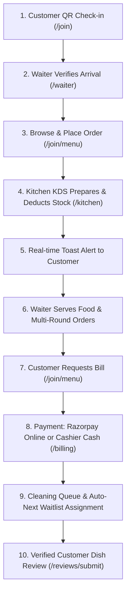

# 🍽️ ResMan OS — Enterprise Restaurant Management System

> **Vibeathon 6.0** · Team **ApexVoid** · Solo Participant: **Ayush Kumar**

---

## 🌐 Live Deployments & API Documentation

| Component | URL | Details / Note |
|---|---|---|
| **Frontend App** | [https://resman-aqqx.vercel.app](https://resman-aqqx.vercel.app) | 🟢 Live on Vercel |
| **Backend API** | [https://resman-backend.onrender.com](https://resman-backend.onrender.com) | 🟢 Live on Render |
| **Swagger API Docs** | [https://resman-backend.onrender.com/docs](https://resman-backend.onrender.com/docs) | 🟢 Interactive OpenAPI (or `/api/v1/docs`) |
| **ReDoc API Docs** | [https://resman-backend.onrender.com/redoc](https://resman-backend.onrender.com/redoc) | 🟢 ReDoc Docs (or `/api/v1/redoc`) |

> 📌 **Note on API Docs**: Swagger UI is accessible at [`/docs`](https://resman-backend.onrender.com/docs) or [`/api/v1/docs`](https://resman-backend.onrender.com/api/v1/docs). Interactive testing is enabled globally across development and production environments.

---

## 👤 Team Info

| Field | Details |
|---|---|
| **Hackathon** | Vibeathon 6.0 |
| **Team Name** | ApexVoid |
| **Team Lead** | Ayush Kumar |
| **Participation** | Solo |

---

## 🧠 What is ResMan OS?

**ResMan OS** is a **full-stack, production-ready restaurant management system** built for modern dine-in restaurants for **Vibeathon 6.0**. It digitises the entire restaurant workflow — starting when a customer scans the **Entrance QR Code** which lands them directly on the **Customer Page** (`/join`) to check in, get assigned a table or join the waitlist, browse the digital menu, and place orders — all the way to kitchen display execution, billing, Razorpay payments, floating notifications, and post-meal reviews in real time.

No paper menus. No manual billing. No shouting across the floor.

---

## 🧪 How to Test (Complete End-to-End Workflow)

You can test the entire real-time restaurant lifecycle on **one device (using multiple browser tabs side-by-side)** or **two devices (e.g., smartphone for customer + laptop for staff)**.

> [!IMPORTANT]
> **Staff Authentication Requirement & Pro-Tip**:
> - **Public Guest Access**: Customer check-in ([`/join`](https://resman-aqqx.vercel.app/join)), digital menu ([`/join/menu`](https://resman-aqqx.vercel.app/join/menu)), payment pages, and reviews do **not** require login.
> - **Staff Role Access**: All staff dashboards ([`/waiter/dashboard`](https://resman-aqqx.vercel.app/waiter/dashboard), [`/kitchen/dashboard`](https://resman-aqqx.vercel.app/kitchen/dashboard), [`/cleaning/dashboard`](https://resman-aqqx.vercel.app/cleaning/dashboard), [`/cashier`](https://resman-aqqx.vercel.app/cashier), [`/manager/dashboard`](https://resman-aqqx.vercel.app/manager/dashboard), etc.) require signing in via [`/sign-in`](https://resman-aqqx.vercel.app/sign-in) with an account assigned to the appropriate staff role.
> - 💡 **Testing Shortcut (Recommended)**: For seamless testing across all staff dashboards simultaneously, **sign in with an `admin` or `manager` account**. Admin and Manager roles have master access to ALL staff dashboards (Waiter, Kitchen KDS, Cashier POS, Cleaning Queue, Inventory, Manager Hub), so you can operate every POS/dashboard without switching accounts!

### 📱 Testing Setup (Side-by-Side Tabs or Mobile + Laptop):
- **Tab 1 (Customer Portal)**: [`https://resman-aqqx.vercel.app/join`](https://resman-aqqx.vercel.app/join) *(Public - No login required)*
- **Tab 2 (Kitchen Display / KDS)**: [`https://resman-aqqx.vercel.app/kitchen/dashboard`](https://resman-aqqx.vercel.app/kitchen/dashboard) *(Requires Staff Login)*
- **Tab 3 (Waiter Dashboard)**: [`https://resman-aqqx.vercel.app/waiter/dashboard`](https://resman-aqqx.vercel.app/waiter/dashboard) *(Requires Staff Login)*
- **Tab 4 (Cleaning Dashboard)**: [`https://resman-aqqx.vercel.app/cleaning/dashboard`](https://resman-aqqx.vercel.app/cleaning/dashboard) *(Requires Staff Login)*
- **Tab 5 (Cashier POS)**: [`https://resman-aqqx.vercel.app/cashier`](https://resman-aqqx.vercel.app/cashier) *(Requires Staff Login)*
- **Tab 6 (Manager Hub)**: [`https://resman-aqqx.vercel.app/manager/dashboard`](https://resman-aqqx.vercel.app/manager/dashboard) *(Requires Staff Login)*

---

### 🔄 Total Workflow Lifecycle (10 Granular Steps)



#### **Step 1: Entrance QR Scan & Customer Check-In (`/join`)**
1. Open [`/join`](https://resman-aqqx.vercel.app/join) on your phone or Tab 1.
2. Enter a **Guest Name** (e.g., `Ayush`) and **Party Size** (e.g., `2`).
3. Tap **Check In & Assign Table**. ResMan OS auto-assigns the best available table based on seating capacity, or automatically adds the guest to the **Waitlist Queue** if all tables are full.
4. Tap **Proceed to Menu**.

#### **Step 2: Waiter Dashboard Arrival Verification (`/waiter/dashboard`)**
1. Switch to Tab 3: Open [`/waiter/dashboard`](https://resman-aqqx.vercel.app/waiter/dashboard).
2. The waiter sees the newly assigned guest and table on the live table grid.
3. Waiter verifies guest arrival and monitors table occupancy status.

#### **Step 3: Browse Digital Menu & Place Order (`/join/menu`)**
1. On Tab 1 (Customer Screen), filter menu by categories (*Mains, Drinks, Veg/Vegan*).
2. Select items, add custom prep notes (e.g., *"Extra spicy, sauce on side"*), and add to cart.
3. Open Cart and tap **Place Order**.
4. Customer sees live status tracking: *Pending / Order Received*.

#### **Step 4: Kitchen KDS Execution & Recipe Stock Deduction (`/kitchen/dashboard`)**
1. Switch to Tab 2: Open [`/kitchen/dashboard`](https://resman-aqqx.vercel.app/kitchen/dashboard).
2. The incoming order ticket appears live on the Kitchen Display System (KDS) with a 3-second auto-refresh.
3. Kitchen staff updates order lifecycle: **Accept** ➔ **Preparing** ➔ **Food Ready**.
4. *Automated Backend Action*: When kitchen accepts the order, ResMan OS automatically deducts ingredient quantities from inventory based on configured dish recipes.

#### **Step 5: Instant Real-Time Status Toast Alert (Customer Screen)**
1. **Look at Tab 1 (Customer Screen)**: Without refreshing the page, a top-floating notification toast pops up (*"Your food is ready!"*) and the order progress bar updates to 100%.

#### **Step 6: Waiter Serving & Multi-Round Orders**
1. Waiter marks items as **Served**.
2. Customers can place multiple order rounds within the same dining session before requesting the bill.

#### **Step 7: Request Consolidated Bill (`/join/menu`)**
1. Once all ordered dishes are served, the **Request Bill** button activates on the Customer screen (Tab 1).
2. Customer taps **Request Bill**, sending an instant alert to both Waiter and Cashier dashboards.

#### **Step 8: Bill Settlement & Payment Options (`/billing/[billId]` or `/cashier`)**
1. Customer taps **Pay Bill** to open the payment page.
2. Select payment method:
   - **Razorpay Online Payment**: Pay via UPI, Card, Net Banking (or test mode). Supports split bill calculation (equal, itemized, or custom).
   - **Cash POS Settlement**: Cashier opens [`/cashier`](https://resman-aqqx.vercel.app/cashier) to process cash, enter change amounts, and mark bill settled.
3. Upon successful payment, the session closes and the table state automatically changes to **Needs Cleaning**.

#### **Step 9: Cleaning Queue & Auto-Assignment for Waitlist (`/cleaning/dashboard`)**
1. Cleaning staff opens [`/cleaning/dashboard`](https://resman-aqqx.vercel.app/cleaning/dashboard).
2. Tap **Mark Cleaned**.
3. *Automated System Action*: The table status returns to **Available**. If guests are waiting in the waitlist queue, ResMan OS automatically assigns the newly cleaned table to the next waitlisted group!

#### **Step 10: Verified Customer Dish Review & Executive Oversight (`/reviews/submit` & `/manager/dashboard`)**
1. Post-payment, the customer is redirected to rate specific dishes ordered (`1-5 stars`) and provide feedback. Only verified, paid customers can review.
2. Managers open [`/manager/dashboard`](https://resman-aqqx.vercel.app/manager/dashboard) or [`/reviews/manage`](https://resman-aqqx.vercel.app/reviews/manage) to view live CSAT ratings, revenue KPIs, recipe profitability margins, and respond to customer reviews.

---

## 🎯 Problem Solved

Traditional restaurants suffer from:
- Slow manual order taking → long wait times
- Paper bills → calculation errors and delays
- No real-time kitchen visibility → food getting cold
- Zero customer feedback loop
- No inventory tracking tied to actual orders

ResMan OS solves all of this in one unified system.

---

## ✨ Features

### 🧑‍💼 Customer Flow
- **Entrance QR Scan & Landing** — Scanning the entrance QR code lands customers directly on the **Customer Page** (`/join`) for instant check-in.
- **Smart Table Assignment** — Customers enter their name + group size, and the system auto-assigns the best-fit table by capacity.
- **Waitlist Queue** — Automatically joins queue if no table is currently available, and auto-assigns when one frees up.
- **Digital Menu** — browse, search, filter by category / vegetarian / vegan
- **Cart & Ordering** — add items, special instructions, place multiple orders per session
- **Top-Floating Popup Toast Notifications** — instant fixed top-center popups on mobile phones for order status updates (*Preparing*, *Food Ready*, *Served*), bill requests, Razorpay payment verification, and staff check-in alerts
- **Live Order Tracking** — real-time KDS progress bar (pending → preparing → ready)
- **Bill Request** — customer taps "Request Bill" (only after all orders complete)
- **Razorpay Payment** — UPI, card, net banking via Razorpay checkout
- **Split Bill** — equal, by item, or custom amount split
- **Post-Payment Review** — star rating per dish ordered, optional comment

### 🛎️ Waiter Dashboard
- **Arrival Verification** — confirm/reject guest arrivals at tables
- **Live Table Matrix** — see all tables with status, click to edit inline
- **Active Orders** — real-time order tracking across all tables
- **Bill Generation** — one-click consolidated bill for entire session
- **Notifications** — bill requests, order ready alerts, 3-min no-order reminders
- **Clear Notifications** — dismiss single or clear all

### 🍳 Kitchen Display System (KDS)
- **Live Order Cards** — auto-refreshing every 3 seconds
- **Status Flow** — Accept → Preparing → Ready → Complete
- **Priority Control** — Normal / High / Urgent (manager only)
- **Pause/Resume** — pause orders mid-preparation with reason
- **Delay Alerts** — visual warning when order exceeds estimated prep time
- **Search & Filter** — by order number or status

### 🧹 Cleaning Staff Dashboard
- **Cleaning Queue** — tables that need cleaning after bill payment
- **Mark Clean** — single tap to mark table as available
- **Live Polling** — auto-refreshes every 5 seconds

### 💵 Cashier POS
- **All Bills View** — see paid and unpaid bills
- **Cash Settlement** — confirm cash payment with change calculator
- **Session Unlock** — manager can unlock locked sessions

### 👔 Manager Executive Dashboard
- **Live KPIs** — today's revenue, active orders, table occupancy %, CSAT rating
- **Top Selling Items** — bar chart of best performers today
- **Recipe Profitability Analyser** — food cost vs selling price, gross margin %, max portions
- **Broadcast Alert** — send urgent announcements to all staff roles
- **Bulk Table Reset** — reset all cleaning/out-of-service tables at once
- **Operations Hub** — quick links to all sub-dashboards

### ⭐ Review System
- Only verified, paid customers can submit reviews
- One review per menu item per dining session
- Manager can reply, hide, or restore reviews
- Prevents duplicate reviews

### 📦 Inventory Management
- Ingredient CRUD with categories
- Stock tracking tied to recipe deductions
- Restock, manual adjustment, waste recording
- Low stock / out of stock alerts on manager dashboard

### 📖 Recipe Management
- Link menu items to ingredients with quantities
- Auto-deducts stock when kitchen accepts an order
- Profitability analyser shows cost/margin per dish

### 👥 Staff Management (Admin)
- Create staff with Clerk-linked accounts
- Role assignment (admin, manager, waiter, kitchen_staff, cashier, cleaning_staff)
- Enable/disable staff accounts
- Role-based access control on every page and API endpoint

### ⚙️ Settings
- Restaurant name, timezone, currency
- Tax percentage, service charge percentage
- Operating hours

---

## 🏗️ Tech Stack

| Layer | Technology |
|---|---|
| **Frontend** | Next.js 16 (App Router), TypeScript, Tailwind CSS |
| **Backend** | FastAPI (Python 3.12), SQLAlchemy 2.0 async |
| **Database** | PostgreSQL (Neon) / SQLite (dev) |
| **Auth** | Clerk (JWT-based, role-aware) |
| **Payments** | Razorpay (UPI, Card, Net Banking) |

| **Containerisation** | Docker + Docker Compose |
| **CI/CD** | GitHub Actions (lint, test, build) |

---

## 📁 Project Structure

```
res/
├── backend/                    # FastAPI application
│   ├── app/
│   │   ├── api/v1/endpoints/   # REST API routes
│   │   │   ├── auth.py         # Clerk JWT auth
│   │   │   ├── billing.py      # Bills, payments, Razorpay
│   │   │   ├── guest.py        # QR check-in, table assignment
│   │   │   ├── inventory.py    # Ingredient stock management
│   │   │   ├── kds.py          # Kitchen Display System
│   │   │   ├── manager.py      # Manager KPIs & overrides
│   │   │   ├── menu.py         # Menu items & categories
│   │   │   ├── order.py        # Customer cart & orders
│   │   │   ├── recipe.py       # Recipe ingredient links
│   │   │   ├── review.py       # Customer reviews
│   │   │   ├── settings.py     # Restaurant configuration
│   │   │   ├── staff.py        # Staff CRUD
│   │   │   └── table.py        # Dining table management
│   │   ├── models/             # SQLAlchemy ORM models
│   │   ├── schemas/            # Pydantic request/response schemas
│   │   ├── services/           # Business logic layer
│   │   ├── middleware/         # CORS, rate limiting, security headers
│   │   └── core/               # Auth dependencies, error handlers
│   ├── migrations/             # Alembic database migrations
│   ├── scripts/                # Seed scripts (roles, etc.)
│   ├── tests/                  # Pytest test suite
│   ├── Dockerfile
│   └── requirements.txt
│
├── frontend/                   # Next.js application
│   ├── src/
│   │   ├── app/
│   │   │   ├── billing/[billId]/   # Payment page
│   │   │   ├── cashier/            # Cashier POS
│   │   │   ├── cleaning/dashboard/ # Cleaning staff
│   │   │   ├── inventory/          # Inventory management
│   │   │   ├── join/               # Customer QR check-in
│   │   │   ├── join/menu/          # Customer digital menu
│   │   │   ├── kitchen/dashboard/  # KDS
│   │   │   ├── manager/dashboard/  # Manager executive hub
│   │   │   ├── menu/               # Menu management (admin)
│   │   │   ├── recipes/            # Recipe management
│   │   │   ├── reviews/            # Review submit & manage
│   │   │   ├── settings/           # Restaurant settings
│   │   │   ├── staff/              # Staff management
│   │   │   ├── tables/             # Table management
│   │   │   └── waiter/dashboard/   # Waiter POS
│   │   ├── components/             # Shared UI components
│   │   ├── hooks/                  # useRBAC, useRouteGuard
│   │   └── services/               # API client functions
│   ├── Dockerfile
│   └── next.config.ts
│
└── docker-compose.yml          # Full stack local setup
```

---

## 🚀 Running Locally

### Prerequisites
- Python 3.12+
- Node.js 20+
- Git

### Backend
```bash
cd backend
python -m venv .venv
source .venv/bin/activate        # Windows: .venv\Scripts\activate
pip install -r requirements.txt
cp .env.example .env             # fill in your values
python -m uvicorn app.main:app --host 0.0.0.0 --port 8000 --reload
```

### Frontend
```bash
cd frontend
npm install
cp .env.example .env.local       # fill in your values
npm run dev
```

### Or with Docker
```bash
cp .env.example .env             # fill in values
docker compose up --build
```

**API Docs:** http://localhost:8000/api/v1/docs

---

## 🌐 Environment Variables

### Backend (`.env`)
```env
APP_ENV=development
DATABASE_URL=sqlite+aiosqlite:///./restaurant_db.sqlite
SECRET_KEY=your-secret-key
CLERK_SECRET_KEY=sk_test_xxx
CLERK_JWKS_URL=https://xxx.clerk.accounts.dev/.well-known/jwks.json
CLERK_ISSUER=https://xxx.clerk.accounts.dev
RAZORPAY_KEY_ID=rzp_test_xxx
RAZORPAY_KEY_SECRET=your_secret
```

### Frontend (`.env.local`)
```env
NEXT_PUBLIC_API_URL=http://localhost:8000
NEXT_PUBLIC_CLERK_PUBLISHABLE_KEY=pk_test_xxx
CLERK_SECRET_KEY=sk_test_xxx
```

---

## 🔑 Role-Based Access

| Role | Pages |
|---|---|
| `admin` | Everything |
| `manager` | Manager Dashboard, Waiter, Kitchen, Tables, Inventory, Menu, Reviews, Settings |
| `waiter` | Waiter Dashboard, Tables, Cashier |
| `kitchen_staff` | Kitchen Dashboard, Inventory |
| `cashier` | Cashier POS, Waiter Dashboard |
| `cleaning_staff` | Cleaning Dashboard |

---

## 🛣️ API Endpoints Summary

| Module | Base Path | Key Operations |
|---|---|---|
| Auth | `/api/v1/auth` | GET me, GET roles |
| Guest | `/api/v1/guest` | Session, table find, queue, verify |
| Order | `/api/v1/orders` | Place, update, cancel, session history |
| KDS | `/api/v1/kds` | Accept, prepare, ready, complete, pause |
| Billing | `/api/v1/billing` | Generate, Razorpay, cash, split, invoices |
| Menu | `/api/v1/menu` | Categories, items, image upload |
| Tables | `/api/v1/tables` | CRUD, status, cleaning queue |
| Inventory | `/api/v1/inventory` | Ingredients, restock, waste, history |
| Recipes | `/api/v1/recipes` | Recipe-ingredient links |
| Reviews | `/api/v1/reviews` | Submit, manage, reply, hide |
| Staff | `/api/v1/staff` | CRUD, roles, status toggle |
| Manager | `/api/v1/manager` | Overview KPIs, profitability, broadcast |
| Settings | `/api/v1/settings` | Restaurant config |

---

## ⚠️ Beta Features

The following features are present but marked **beta** — they work in basic form but are not fully polished:

| Feature | Status | Notes |
|---|---|---|
| **Split Bill** | 🟡 Beta | Equal, itemized, and custom split calculation supported with Razorpay & Cash settlements. |
| **Staff Role-Based Nav** | 🟡 Beta | `RouteGuard`, `AppLayout`, `Navbar` components exist but not fully wired to every page. |
| **Loyalty / Rewards** | ❌ Not Implemented | Models exist in DB schema, no UI or service logic built. |
| **Customer Accounts** | ❌ Not Implemented | Guests can order without accounts. Registered customer profiles exist in DB but no registration flow. |
| **Analytics Dashboard** | ❌ Not Implemented | Manager KPIs are live data but no charts/graphs UI beyond top selling items. |

---

## 📸 Pages Overview

| Page | URL | Role |
|---|---|---|
| Customer Check-in (Entrance QR Landing) | `/join` | Public |
| Customer Menu | `/join/menu` | Public |
| Billing & Payment | `/billing/[billId]` | Public |
| Leave a Review | `/reviews/submit` | Public (post-payment) |
| Sign In | `/sign-in` | Public |
| Waiter Dashboard | `/waiter/dashboard` | waiter, manager, admin |
| Kitchen (KDS) | `/kitchen/dashboard` | kitchen_staff, manager, admin |
| Cleaning | `/cleaning/dashboard` | cleaning_staff, manager, admin |
| Cashier POS | `/cashier` | cashier, waiter, manager, admin |
| Manager Hub | `/manager/dashboard` | manager, admin |
| Tables | `/tables` | waiter, manager, admin |
| Menu Management | `/menu/items` | manager, admin |
| Inventory | `/inventory` | kitchen_staff, manager, admin |
| Recipes | `/recipes` | manager, admin |
| Staff | `/staff` | admin |
| Reviews Management | `/reviews/manage` | manager, admin |
| Settings | `/settings` | admin |

---

## 🏆 Hackathon Highlights

- **Vibeathon 6.0 Project** — End-to-end digitised dine-in experience built for Vibeathon 6.0.
- **Entrance QR Landing** — Scanning the entrance QR code lands guests directly on the Customer Page (`/join`) to check in and start ordering.
- **End-to-end flow** — from customer QR scan to paid bill to review, zero manual intervention
- **Real-time** — 3-second polling on all dashboards, instant notifications
- **Multi-role** — 6 distinct staff roles, each with scoped access
- **Mobile-friendly** — all dashboards fully responsive
- **Production-ready** — Docker, CI/CD, Alembic migrations, CORS, error handling, audit logs, soft deletes
- **Security** — HMAC Razorpay verification, Clerk JWT auth, HTML sanitization on reviews, rate limit middleware

---

*Built with ❤️ for Vibeathon 6.0 by Ayush Kumar — ApexVoid*
