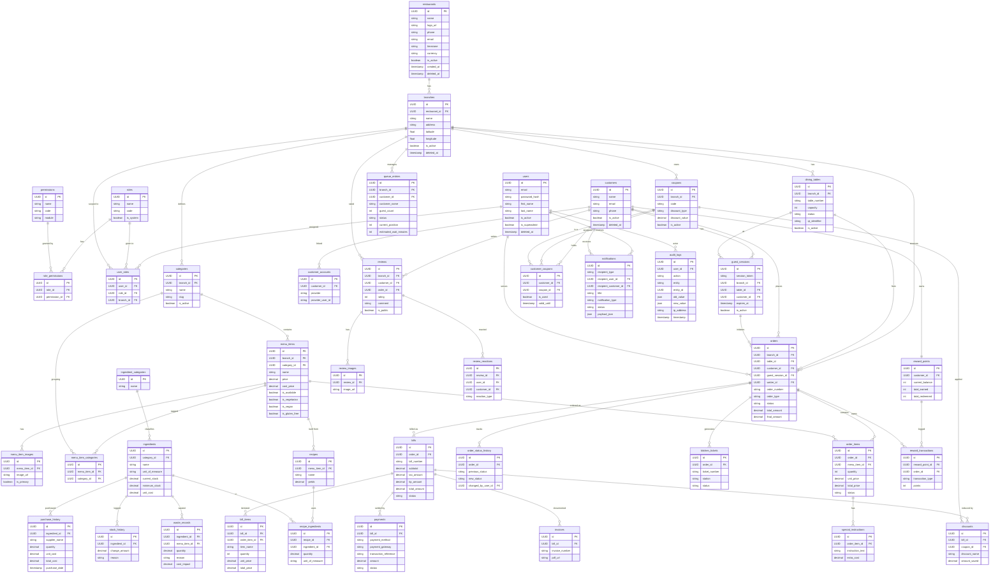

```mermaid
erDiagram
    restaurants {
        UUID id PK
        string name
        string logo_url
        string phone
        string email
        string timezone
        string currency
        boolean is_active
        timestamp created_at
        timestamp deleted_at
    }

    branches {
        UUID id PK
        UUID restaurant_id FK
        string name
        string address
        float latitude
        float longitude
        boolean is_active
        timestamp deleted_at
    }

    users {
        UUID id PK
        string email
        string password_hash
        string first_name
        string last_name
        boolean is_active
        boolean is_superadmin
        timestamp deleted_at
    }

    roles {
        UUID id PK
        string name
        string code
        boolean is_system
    }

    permissions {
        UUID id PK
        string name
        string code
        string module
    }

    role_permissions {
        UUID id PK
        UUID role_id FK
        UUID permission_id FK
    }

    user_roles {
        UUID id PK
        UUID user_id FK
        UUID role_id FK
        UUID branch_id FK
    }

    customers {
        UUID id PK
        string name
        string email
        string phone
        boolean is_active
        timestamp deleted_at
    }

    guest_sessions {
        UUID id PK
        string session_token
        UUID branch_id FK
        UUID table_id FK
        UUID customer_id FK
        timestamp expires_at
        boolean is_active
    }

    customer_accounts {
        UUID id PK
        UUID customer_id FK
        string provider
        string provider_user_id
    }

    dining_tables {
        UUID id PK
        UUID branch_id FK
        string table_number
        int capacity
        string status
        string qr_identifier
        boolean is_active
    }

    queue_entries {
        UUID id PK
        UUID branch_id FK
        UUID customer_id FK
        string customer_name
        int guest_count
        string status
        int current_position
        int estimated_wait_minutes
    }

    categories {
        UUID id PK
        UUID branch_id FK
        string name
        string slug
        boolean is_active
    }

    menu_items {
        UUID id PK
        UUID branch_id FK
        UUID category_id FK
        string name
        decimal price
        decimal cost_price
        boolean is_available
        boolean is_vegetarian
        boolean is_vegan
        boolean is_gluten_free
    }

    menu_item_images {
        UUID id PK
        UUID menu_item_id FK
        string image_url
        boolean is_primary
    }

    menu_item_categories {
        UUID id PK
        UUID menu_item_id FK
        UUID category_id FK
    }

    ingredient_categories {
        UUID id PK
        string name
    }

    ingredients {
        UUID id PK
        UUID category_id FK
        string name
        string unit_of_measure
        decimal current_stock
        decimal minimum_stock
        decimal unit_cost
    }

    recipes {
        UUID id PK
        UUID menu_item_id FK
        string name
        decimal yields
    }

    recipe_ingredients {
        UUID id PK
        UUID recipe_id FK
        UUID ingredient_id FK
        decimal quantity
        string unit_of_measure
    }

    purchase_history {
        UUID id PK
        UUID ingredient_id FK
        string supplier_name
        decimal quantity
        decimal unit_cost
        decimal total_cost
        timestamp purchase_date
    }

    stock_history {
        UUID id PK
        UUID ingredient_id FK
        decimal change_amount
        string reason
    }

    waste_records {
        UUID id PK
        UUID ingredient_id FK
        UUID menu_item_id FK
        decimal quantity
        string reason
        decimal cost_impact
    }

    orders {
        UUID id PK
        UUID branch_id FK
        UUID table_id FK
        UUID customer_id FK
        UUID guest_session_id FK
        UUID waiter_id FK
        string order_number
        string order_type
        string status
        decimal total_amount
        decimal final_amount
    }

    order_items {
        UUID id PK
        UUID order_id FK
        UUID menu_item_id FK
        int quantity
        decimal unit_price
        decimal total_price
        string status
    }

    order_status_history {
        UUID id PK
        UUID order_id FK
        string previous_status
        string new_status
        UUID changed_by_user_id FK
    }

    kitchen_tickets {
        UUID id PK
        UUID order_id FK
        string ticket_number
        string station
        string status
    }

    special_instructions {
        UUID id PK
        UUID order_item_id FK
        string instruction_text
        decimal extra_cost
    }

    bills {
        UUID id PK
        UUID order_id FK
        string bill_number
        decimal subtotal
        decimal tax_amount
        decimal tip_amount
        decimal total_amount
        string status
    }

    bill_items {
        UUID id PK
        UUID bill_id FK
        UUID order_item_id FK
        string item_name
        int quantity
        decimal unit_price
        decimal total_price
    }

    payments {
        UUID id PK
        UUID bill_id FK
        string payment_method
        string payment_gateway
        string transaction_reference
        decimal amount
        string status
    }

    invoices {
        UUID id PK
        UUID bill_id FK
        string invoice_number
        string pdf_url
    }

    coupons {
        UUID id PK
        UUID branch_id FK
        string code
        string discount_type
        decimal discount_value
        boolean is_active
    }

    discounts {
        UUID id PK
        UUID bill_id FK
        UUID coupon_id FK
        string discount_name
        decimal amount_saved
    }

    reviews {
        UUID id PK
        UUID branch_id FK
        UUID customer_id FK
        UUID order_id FK
        int rating
        string comment
        boolean is_public
    }

    review_images {
        UUID id PK
        UUID review_id FK
        string image_url
    }

    review_reactions {
        UUID id PK
        UUID review_id FK
        UUID user_id FK
        UUID customer_id FK
        string reaction_type
    }

    reward_points {
        UUID id PK
        UUID customer_id FK
        int current_balance
        int total_earned
        int total_redeemed
    }

    reward_transactions {
        UUID id PK
        UUID reward_point_id FK
        UUID order_id FK
        string transaction_type
        int points
    }

    customer_coupons {
        UUID id PK
        UUID customer_id FK
        UUID coupon_id FK
        boolean is_used
        timestamp valid_until
    }

    notifications {
        UUID id PK
        string recipient_type
        UUID recipient_user_id FK
        UUID recipient_customer_id FK
        string title
        string notification_type
        string status
        json payload_json
    }

    audit_logs {
        UUID id PK
        UUID user_id FK
        string action
        string entity
        UUID entity_id
        json old_value
        json new_value
        string ip_address
        timestamp timestamp
    }

    %% Multi-Tenancy
    restaurants ||--o{ branches : "has"

    %% RBAC
    users ||--o{ user_roles : "assigned"
    roles ||--o{ user_roles : "given to"
    branches ||--o{ user_roles : "scoped to"
    roles ||--o{ role_permissions : "has"
    permissions ||--o{ role_permissions : "granted by"

    %% Customers
    customers ||--o{ guest_sessions : "has"
    customers ||--o{ customer_accounts : "linked"
    customers ||--|| reward_points : "owns"
    customers ||--o{ customer_coupons : "holds"
    customers ||--o{ reviews : "writes"

    %% Tables & Queue
    branches ||--o{ dining_tables : "has"
    branches ||--o{ queue_entries : "manages"
    dining_tables ||--o{ guest_sessions : "at"

    %% Menu
    branches ||--o{ categories : "defines"
    categories ||--o{ menu_items : "contains"
    menu_items ||--o{ menu_item_images : "has"
    menu_items ||--o{ menu_item_categories : "tagged"
    categories ||--o{ menu_item_categories : "grouping"

    %% Recipe & Inventory
    menu_items ||--o{ recipes : "built from"
    recipes ||--o{ recipe_ingredients : "uses"
    ingredients ||--o{ recipe_ingredients : "in"
    ingredient_categories ||--o{ ingredients : "classifies"
    ingredients ||--o{ purchase_history : "purchased"
    ingredients ||--o{ stock_history : "logged"
    ingredients ||--o{ waste_records : "wasted"

    %% Orders
    branches ||--o{ orders : "receives"
    dining_tables ||--o{ orders : "from"
    customers ||--o{ orders : "places"
    guest_sessions ||--o{ orders : "initiates"
    users ||--o{ orders : "serves"
    orders ||--o{ order_items : "contains"
    orders ||--o{ order_status_history : "tracks"
    orders ||--o{ kitchen_tickets : "generates"
    menu_items ||--o{ order_items : "ordered as"
    order_items ||--o{ special_instructions : "has"

    %% Billing
    orders ||--o{ bills : "billed as"
    bills ||--o{ bill_items : "itemized"
    bills ||--o{ payments : "settled by"
    bills ||--o{ invoices : "documented"
    bills ||--o{ discounts : "reduced by"
    coupons ||--o{ discounts : "applied"
    coupons ||--o{ customer_coupons : "assigned"
    branches ||--o{ coupons : "owns"

    %% Reviews
    branches ||--o{ reviews : "rated"
    reviews ||--o{ review_images : "has"
    reviews ||--o{ review_reactions : "reacted"

    %% Loyalty
    reward_points ||--o{ reward_transactions : "logged"
    orders ||--o{ reward_transactions : "earns"
    customer_coupons }o--|| coupons : "is a"

    %% Notifications
    users ||--o{ notifications : "receives"
    customers ||--o{ notifications : "receives"

    %% Audit
    users ||--o{ audit_logs : "actor"
```
